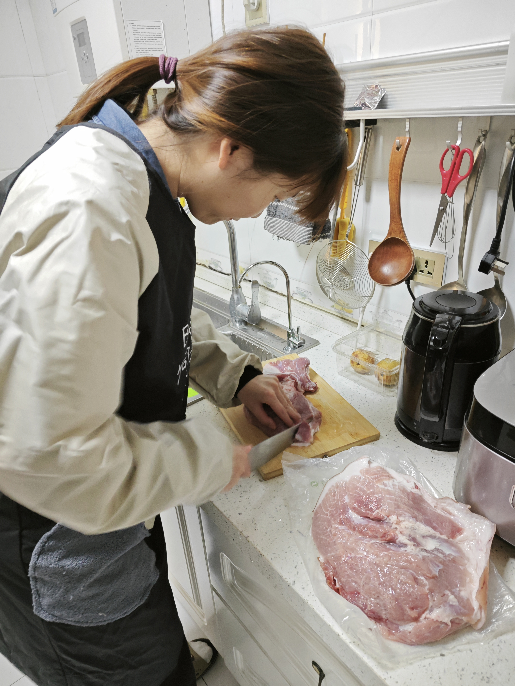
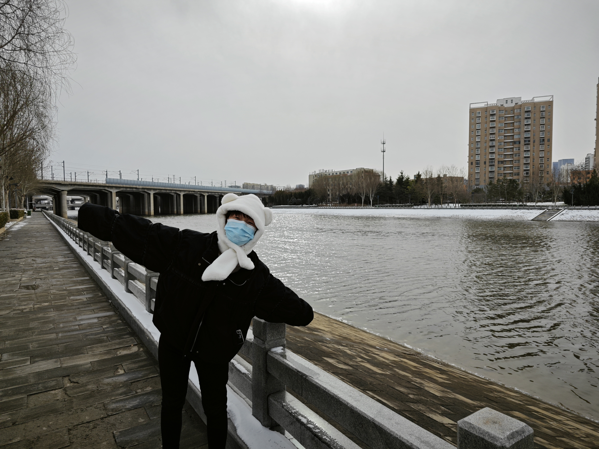

# 2023年度总结

## 生活

### 旅行

### 读书

### 电影

### 娱乐

## 学习

## 情感

### 宛妘

2023年是我与宛妘携手走过的第二个春秋。在这时光流转的一年里，我们不仅品味了生活的酸甜苦辣，更在彼此陪伴中共同绽放成长的芬芳。

年初因为宛妘家人身体原因，我们去了郑州拜访了宛妘的叔叔阿姨。

春节在我家过的，宛妘第一次去我的家乡，第一次见到了我的父母。

<video src="../img/2023_annual_report/VID_20230121_191624_HSR_120.mp4" width="800px" height="600px" controls="controls"></video>

### 爷爷